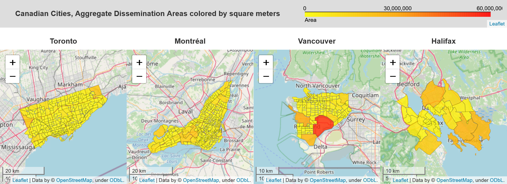
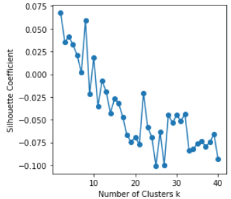
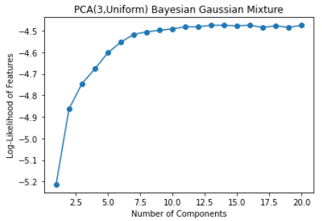
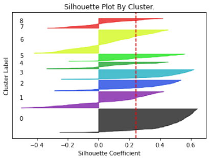
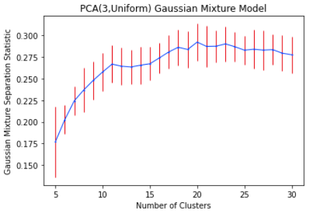

# Neighborhood-Clustering-Canada

## Overview
In this notebook a procedure for identifying similar areas between different cities is developed.  Uses of such a procedure include recommenders (suggesting regions of a new city that a user might like based on similarity to regions that user likes in other cities) and real estate assessment (identifying regions that exhibit or might undergo certain trends).

The comparison procedure is developed using data from four cities from Canada: Toronto, Montréal, Vancouver, and Halifax.  This method can be applied to other cities in other countries as well, though that will require collection of data from different sources.

The approach is briefly summarized by these activities:
* Collection of data
    * Geographic boundaries of regions of interest (location, area)
    * Census statistics (population, dwelling count, etc.)
    * Business information (type, location)
* Processing of data
    * Determination of best geometric areas for analysis based on average size
    * Creation of locally descriptive variables (e.g. population denisty from population and area)
    * Normalization of singleton and vector features
* K-means clustering
    * Initial clustering
    * Feature downselection based on p-values for initial clustering
    * Final clustering with optimal k=5 determined by elbow, gap statistic, and silhouette methods
* Extensions
    * K-means clustering with uniformly scaled features
    * Gaussian mixture model clustering
    * Bayesian Gaussian mixture model clustering
    * Mean shift clustering
    * Principal Component Analysis
        * Bayesian Gaussian mixture clustering
        * Optimal Gaussian mixutre model with 20 clusters and 3 principal components

Several techniques and features are used in this analysis which may be of interest to future projects:
* Display of multiple choropleth maps side-by-side with single joint color scale using folium (_mapCitiesAdjacent_)
* Efficient geometry overlap calculation using geopandas/shapely (_intersectGDF_), handling large datasets (e.g. 50,000 dissemination areas of Canada) and large geometries (>1,000,000 vertices for largest forward sortation area of Canada) by combining the inbuilt spatial join function with custom geometry segmentation and reconstitution, also available using multiprocessing as intersectGDFMP; see section _Forward Sortation Areas_ or _OvervapDevelopment.ipynb_ for details, or _CapstoneOverlap.py_
* Validation of overlap geometries, which identified 22 errors in the Statistics Canada Forward Sortation Area boundary file
* Cacheing of results and plots for fast loading or automatic as-needed recalculation
* Model training on a parameter grid similar to GridSearchCV but for classification and without model re-use, with some generic plotting functionality implemented
* Gap statistic calculation, including generalization for arbitrary scikit-learn models
* Visualization using seaborn and yellowbrick
* Interactive 3D scatter plots using plotly.express
* Generic _extendBound_ function for rounding of numbers or arrays in useful ways (e.g. nearest leading digit, nearest power, up or down)
* Useful functions collected in _CapstoneUtil.py_ and _CapstoneOverlap.py_ modules

NOTE: To run this project, create a file "config.py" in the main project directory and add your access keys to the following variables:

    # This is a test, and is expected not to be uploaded to github
    HERE_APIKEY = '...'
    NM_AGENT = '...' # a nominatim agent name, not required
    FOURSQUARE_CLIENT_ID = '...'
    FOURSQUARE_CLIENT_SECRET = '...'
    FOURSQUARE_ACCESS_TOKEN = '...'

## Results

Illustrative plots are shown below.  See _Neighborhood-Clustering-Canada.ipynb_ for details.  The best clustering for a k-means model was obtained with k=5, but a much better result was obtained in the extensions section with a k=20 Gaussian mixture model fit to the first three principal components.  The final result is detailed at the end of this README.

### Geographic Regions

Dissemination Areas were selected based on their Census Consolidated Subdivision (CCS) name in the boundary file data, and selection criteria adjusted to produce a visually relevant area for each city under consideration.  Other area types (Agglomerated Dissemination Areas, Census Tracts, Forward Sortation Areas) were assigned based on their overlap with the Dissemination Areas previously assigned to each city.

Summary of geographic areas considered, with histograms of area size in square meters with the ideal walking range of 250-750 meters highlighted:

#### Dissemination Area (DA):

#### Agglomerated Dissemination Area (ADA):

#### Census Tract (CT):

#### Forward Sortation Area (FSA):

##### Geometry Overlaps

Note that Forward Sortation Area association with Dissemination Areas had to be derived from scratch using the two sets of boundary files.  See section 4.4 and file _OverlapDevelopment.py_ for details of the algorithm.  The algorithm employs a geopandas spatial join for potential overlap selection and a geopandas intersection for actual overlap calculation with the modification that if large geometries are involved (empirically, greater than 10,000 points) the geometries are segmented and the intersections are performed after a second spatial join on the pieces.  This resulted in an improved calculation time of ~14 minutes for calculating overlaps between all DAs and FSAs in Canada, whereas naive implementation took over 17 hours.  Marginal additonal speedups result from multiprocess deployment of this algorithm, and eliminating null overlaps through taking a matrix of actual overlap areas as input.

Two useful dataframes encapsulate the overlap results:

    df_da2fsa  For a given DA index, contains a list of FSAs that it overlaps
                and a list of areas of overlap relative to the DA area

    df_fsa2da  For a given FSA index, contains a list of DAs that it overlaps
                and a list of areas of overlap relative to the FSA area

There are some FSAs that do not comply with the definition of respecting DA boundaries (multiple DAs overlap a single FSA):

#### Region selection

Based on the area histograms, the regions selected for further analysis were Census Tracts because they most encapsulate our idea of neighborhood size.

### Feature Generation

Features were derived from census data obtained from Statistics Canada and venue lists obtained from Foursquare.  See also project _Neighborhood-Clustering-Toronto_ for earlier development.  Census data was scaled to a normal distribution using a QuantileTransformer.  Venue data was encoded as a unit vector of category counts, which naturally has unit variance.  The venue count was normalized by venue query area to give a venue density, which was then scaled as per the census data.

Missing data was replaced with the city mean or zero as appropriate.

Features selected were:
* Population Density: Total population divided by the area in the census file
* Population Trend: Percent change in population over the previous five years
* Dwelling Occupancy: Total population divided by number of dwellings occupied by normal residents
* Dwelling Nonresidency: Fraction of dwellings not occupied by normal residents
* Venue Density: Number of venues returned by Foursquare query divided by the area of a circle with the Foursquare query radius
* Venue Vector: Unit vector consisting of columns of venue category counts:
    * Arts & Entertainment
    * College & University *Dropped due to low f-score on initial clustering*
    * Food
    * Nightlife Spot
    * Outdoors & Recreation
    * Professional & Other Places *Dropped due to low f-score on initial clustering*
    * Residence *Dropped due to low f-score on initial clustering*
    * Shop & Service
    * Travel & Transport

### Feature Downselection

An initial k-means clustering was used to generate f-falues for each feature for each number of clusters k.  Taking the geometric mean of f-values for p=0.05 for cluster counts 1 through 10 resulted in the following predictive power for each feature:

The three lowest f-valued features were dropped (College & University, Professional & Other Places, Residence) and the resulting vector renormalized.

### K-Means Clustering

The elbow method, gap statistic, and silhouette coefficient were used to select k=5 as the best k-means cluster number of the reduced feature set.

A pairplot can help us visualize the clustering results in the feature space:

The feature values are averaged for each cluster (note that these are the scaled values):

The clusters are visualized on a map, using the average feature values to assign a description:

For an improvement on this, see the final section (Principal Component Analysis / Gaussian Mixture Model).

### Extensions

Several approaches were taken to try to improve upon the clustering:

#### Uniform Feature Scaling

Instead of a normal QuantileTransformer, a uniform QuantileTransformer was used to scale features, followed by multiplication by the inverse of the feature variance in order to produce unit variance.  This resulted in qualitatively similar results, with the greatest difference appearing via pairplot:

#### Gaussian Mixture Model

A Gaussian mixture model assigns clusters based on relative probabilities of Gaussian distributions with free centerpoints and covariance matrices, also via an evaluation-minimization algorithm.  It is useful for clustering normal distributions that may be stretched or squashed along arbitraty axes.  The relevant optimization criteria are the Akaike and Bayesian (which vary in their free-parameter penalty).

Normal scaled features, 8 optimal clusters:

Uniform scaled features, 10 optimal clusters:

#### Bayesian Gaussian Mixture Model

This model incorporates cluster count optimization through allowing cluster weights to go to zero.  Normal-scaled features were used.

To evaluate this model the cluster weight was obtained for multiple maximum cluster number.  The weights are plotted as an image below and show a similar shape as the maximum cluster number is increased.  Note that cluster weight does not exactly correspond to the number of points assigned to a given cluster.

#### Mean Shift

This model is useful when clusters are significantly merged, and is attempted since the pairplots so far have not shown much clustering by eye.

The fitting was very sensitive to the bandwidth, and pairplots showed poor cluster definition.

Normal feature scaling, 8 optimal clusters:

Uniform feature scaling, 10 optimal clusters:

The clusters in the pairplots look even more broad than with prior methods.

#### Principal Component Analysis

This method linearly transforms a feature set into a new set of mutually orthogonal (zero covariance) features, where explained variance is maximized.  This new feature set can be clusterd using any method just as for the original feature set.  This analysis uses the uniform-scaled features because of the minimization of outliers, though the resulting distributions for normal-scaled features were not too different.

The coefficients of the old components that compose the new components are:

And a pairplot lets us see that clustered correlations are now visible in the first three components:

For fitting a Bayesian Gaussian Mixture Model to all 11 PCA features:

But this fails to identify all visible clusters (a zoomed-in view of the first three components, increasing component count does not improve this):

For fitting a Bayesian Gaussian Mixture Model to 6 PCA features that comprise 85% of the explained variance:

This does better at identifying all visible clusters:

For fitting a Bayesian Gaussian Mixture Model to 3 PCA features that display obvious clustering:

The number of components that have points assigned to them as a function of the maximum number of coponents is:

This also does well at identifying all visible clusters:

Which is more apparent in a 3D rendering:

Note however that some clusters (e.g. 7, 8, and 5) show structure inside them.  To force fitting to these internal clusters, we must return to a Gaussian Mixture Model where we can set the number of components.

For fitting a Gaussian Mixture Model to 3 PCA features:

The gap statistic calculation was generalized for any sklearn clustering model that depends on random initialization (currently just KMeans, GaussianMixture, and BayesianGaussianMixture), but the resulst are not so informative because this statistic still assumes spherical clusters:

A new statistic was generated as the ratio between the largest cluster probability for each point to the sum of all other cluster probabilities for that point, averaged over the entire ensemble.  Smaller values indicate confident cluster assignment, larger values indicate a cluster is close to a decision boundary.  At the left the dip is due to well-separated clusters, at the right the dip is due to overfitting, and in the middle seems to be a happy medium.

The optimum point is k=20, which gives the following clustering which looks very good:

The 3D plot of clusters looks to have solved the sub-cluster problem from before.  If this interactive plot is run for other cluster numbers, first number of components to break up cluster 7 from above is 13 (for which it goes to two clusters) and 16 (for which it goes to three) and 19 (for which the side clusters seem reasonable by eye as well, and we note the silhouette coefficient is another local maximum).

Using these cluster labels with the original data allows display of the average and standard deviation of feature values for each cluster.  A count of points in each cluster is also appended.

The clusters are visualized on a map, though without qualitative descriptions:

Functions are provided to generate a choropleth map for viewing of any feature value.  For example the Dwelling Occupancy is shown below, which varies nearly inversely with the Population Density:

